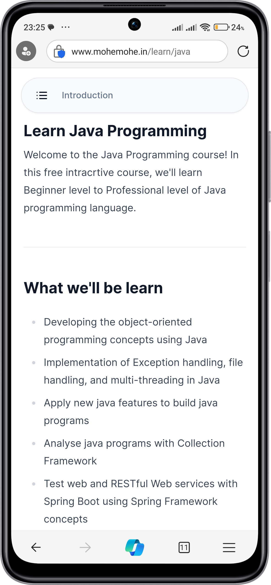
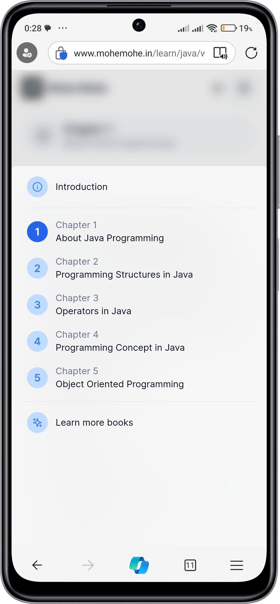
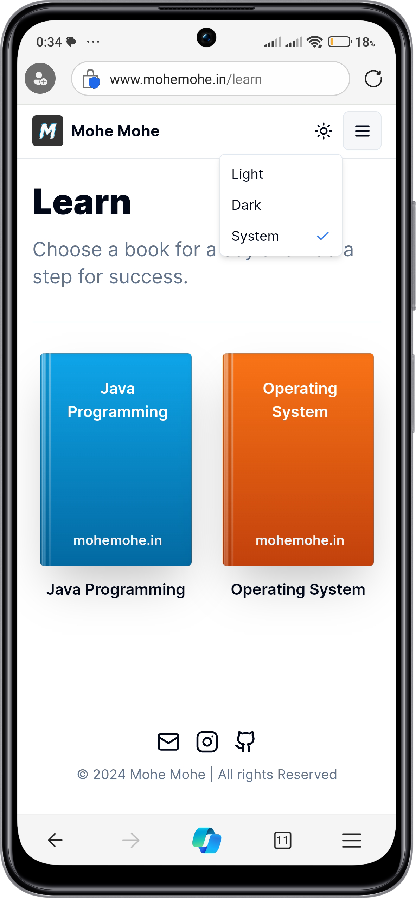
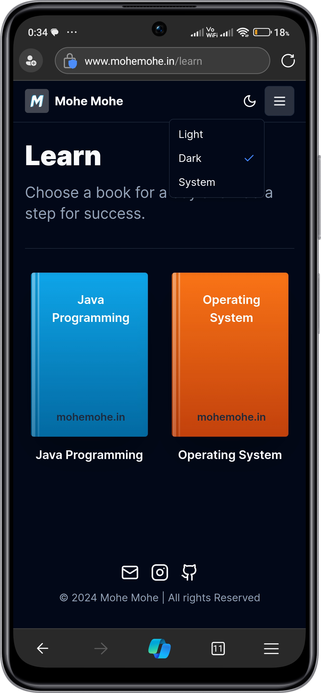

<p align="center">
  <a href="https://www.mohemohe.in">
    
  </a>
</p>

<h1 align="center"><b>Mohe Mohe</b></h1>

<p align="center">
  <a href="https://github.com/princekunal101/mohemohe/blob/master/LICENSE">
    
  </a>
  <a href="https://github.com/princekunal101/mohemohe/issues">
    
  </a>
  <a href="https://github.com/princekunal101/mohemohe/pulls">
    
  </a>
  <a href="https://github.com/princekunal101/mohemohe/graphs/contributors">
    
  </a>
</p>

<p align="center">
  Creative learning app for students and quick revision content/articles to enhance programming skills and knowledge for engineering students.
</p>

---

## Table of Contents

- [About The Project](#about-the-project)
  - [Built With](#built-with)
- [Getting Started](#getting-started)
  - [Prerequisites](#prerequisites)
  - [Installation](#installation)
- [Usage](#usage)
- [Roadmap](#roadmap)
- [Contributing](#contributing)
- [License](#license)
- [Contact](#contact)
- [Acknowledgements](#acknowledgements)

## About The Project

<a href="https://www.mohemohe.in/">
<p align="center">
  
  
</p>
</a>

Free articles and programming language learning resources.

### Built With

- [Next.js 14](https://nextjs.org)
- [Tailwind CSS](https://tailwindcss.com)
- [shadcn/ui](https://ui.shadcn.com)

## Getting Started

### Prerequisites

- Node.js

### Installation

1. Clone the repo
   ```sh
   git clone https://github.com/princekunal101/mohemohe.git
   ```
2. Install dependencies
   ```sh
   npm install
   ```
3. Configure environment variables
   ```sh
   cp .env.example .env
   ```

## Usage

<p align="center">
  
  
  
</p>

## Roadmap

- Read Articles  
- Learn Programming Languages

See [open issues](https://github.com/princekunal101/mohemohe/issues) for proposed features.

## Contributing

1. Fork the Project  
2. Create a Feature Branch (`git checkout -b feature/AmazingFeature`)  
3. Commit Changes (`git commit -m 'Add AmazingFeature'`)  
4. Push to Branch (`git push origin feature/AmazingFeature`)  
5. Open a Pull Request  

## License

Distributed under the MIT License. See `LICENSE` for details.

## Contact

Project Link: [https://github.com/princekunal101/mohemohe](https://github.com/princekunal101/mohemohe)

## Acknowledgements

- [Lucide Icons](https://lucide.dev)  
- [Vercel](https://vercel.com)  
- [MDX](https://mdxjs.com)

---

## Learn

- [`Java Programming`](https://www.mohemohe.in/learn/java)  
- [`Java Programming Lab`](https://www.mohemohe.in/blog/opps-java-lab)  
- [`Operating System`](https://www.mohemohe.in/learn/operating-system)  
- [`Operating System Lab`](https://www.mohemohe.in/blog/operating-system-lab)
